# <h1 align="center">✨ Hi there, I'm Niveditagupta03 👋</h1>

  

  
  
  

 

<!-- Side-by-Side Cards: Planetary Orbit + Constellation Telemetry HUD -->

  <table border="0" cellspacing="0" cellpadding="0">
    <tr>
      <td width="50%" align="center" valign="top" style="padding-right: 8px;">
        
      </td>
      <td width="50%" align="center" valign="top" style="padding-left: 8px;">
        
      </td>
    </tr>
  </table>

 

<!-- Centered Cosmic Contribution Matrix -->

  

 

---

  ✨ <i>Powered by Cosmic Galaxy SVG Engine</i>

